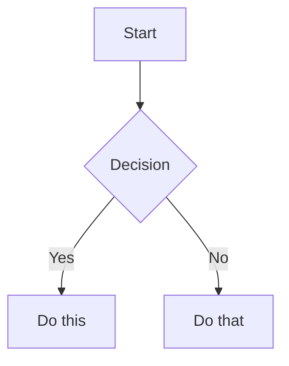

# Markdown Cheatsheet

A quick reference for Markdown syntax, GitHub Flavored Markdown (GFM), and formatting tips.

## Table of Contents
- [Headings](#headings)
- [Text Formatting](#text-formatting)
- [Lists](#lists)
- [Links & Images](#links--images)
- [Code](#code)
- [Tables](#tables)
- [Blockquotes & Callouts](#blockquotes--callouts)
- [GitHub Flavored Markdown](#github-flavored-markdown)
- [Advanced Formatting](#advanced-formatting)

---

## Headings

Six levels of headings using `#` symbols.

```markdown
# Heading 1
## Heading 2
### Heading 3
#### Heading 4
##### Heading 5
###### Heading 6
```

Alternative syntax for H1 and H2:

```markdown
Heading 1
=========

Heading 2
---------
```

---

## Text Formatting

Emphasize and style inline text.

```markdown
**bold text**
__also bold__

*italic text*
_also italic_

***bold and italic***
___also bold and italic___

~~strikethrough~~

`inline code`

<u>underline</u> (HTML, works on GitHub)

Superscript: x<sup>2</sup>
Subscript: H<sub>2</sub>O

Horizontal rule:
---
***
___
```

---

## Lists

Ordered, unordered, and nested lists.

```markdown
<!-- Unordered list -->
- Item one
- Item two
- Item three

<!-- Also valid with * or + -->
* Item one
+ Item two

<!-- Ordered list -->
1. First item
2. Second item
3. Third item

<!-- Ordered list (numbers don't matter, auto-increments) -->
1. First
1. Second
1. Third

<!-- Nested list (indent with 2 or 4 spaces) -->
- Parent item
  - Child item
  - Another child
    - Grandchild
- Another parent

<!-- Task list (GitHub Flavored Markdown) -->
- [x] Completed task
- [ ] Incomplete task
- [x] Another done task

<!-- List with paragraph continuation (blank line + indent) -->
1. First item

   This paragraph belongs to the first item.

2. Second item
```

---

## Links & Images

Create hyperlinks and embed images.

```markdown
<!-- Inline link -->
[Link text](https://example.com)
[Link with title](https://example.com "Hover tooltip")

<!-- Reference-style link -->
[Link text][ref-id]

[ref-id]: https://example.com "Optional title"

<!-- Auto-link (bare URL) -->
<https://example.com>
<user@example.com>

<!-- Relative link (within repo) -->
[README](../README.md)
[Section](#section-name)

<!-- Image -->


<!-- Image with link -->
[](https://example.com)

<!-- Reference-style image -->
![Alt text][img-ref]

[img-ref]: https://example.com/image.png "Title"

<!-- HTML image with size control -->

```

---

## Code

Inline code and fenced code blocks.

````markdown
<!-- Inline code -->
Use `console.log()` to debug.

<!-- Fenced code block with language identifier -->
```javascript
function greet(name) {
  return `Hello, ${name}!`;
}
```

```python
def greet(name: str) -> str:
    return f"Hello, {name}!"
```

```bash
echo "Hello, World!"
git commit -m "feat: add greeting function"
```

```sql
SELECT name, email FROM users WHERE active = true;
```

```json
{
  "name": "Alice",
  "age": 30,
  "active": true
}
```

```yaml
name: Alice
age: 30
active: true
```

```diff
- old line (removed)
+ new line (added)
  unchanged line
```

<!-- Indented code block (4 spaces) -->
    This is a code block
    using indentation
````

---

## Tables

Create structured data tables.

```markdown
<!-- Basic table -->
| Column 1 | Column 2 | Column 3 |
|----------|----------|----------|
| Cell 1   | Cell 2   | Cell 3   |
| Cell 4   | Cell 5   | Cell 6   |

<!-- Column alignment -->
| Left     | Center   | Right    |
|:---------|:--------:|---------:|
| left     | center   | right    |
| aligned  | aligned  | aligned  |

<!-- Minimal pipes (also valid) -->
Column 1 | Column 2
-------- | --------
Cell 1   | Cell 2

<!-- Table with inline formatting -->
| Name    | Type     | Required | Description          |
|---------|----------|----------|----------------------|
| `id`    | `number` | Yes      | Unique identifier    |
| `name`  | `string` | Yes      | Display name         |
| `email` | `string` | No       | Contact email        |
```

---

## Blockquotes & Callouts

Highlight important information.

```markdown
<!-- Basic blockquote -->
> This is a blockquote.

<!-- Multi-line blockquote -->
> First line of the quote.
> Second line of the quote.

<!-- Nested blockquote -->
> Outer quote
>
> > Inner nested quote

<!-- Blockquote with other elements -->
> ### Heading inside blockquote
>
> - List item
> - Another item
>
> **Bold text** inside a blockquote.

<!-- GitHub callout/alert syntax (GFM) -->
> [!NOTE]
> Useful information that users should know.

> [!TIP]
> Helpful advice for doing things better.

> [!IMPORTANT]
> Key information users need to know.

> [!WARNING]
> Urgent info that needs immediate attention.

> [!CAUTION]
> Advises about risks or negative outcomes.
```

---

## GitHub Flavored Markdown

Features specific to GitHub's Markdown renderer.

```markdown
<!-- Task lists -->
- [x] Write the code
- [x] Write tests
- [ ] Update documentation
- [ ] Deploy to production

<!-- Mention a user -->
@username

<!-- Reference an issue or PR -->
Fixes #42
Closes #123
See PR #456

<!-- Reference a commit -->
abc1234
username@abc1234
username/repo@abc1234

<!-- Emoji -->
:tada: :rocket: :bug: :white_check_mark:
:warning: :information_source: :x: :heavy_check_mark:

<!-- Footnotes -->
Here is a statement with a footnote.[^1]

[^1]: This is the footnote content.

<!-- Collapsed section (details/summary) -->
<details>
<summary>Click to expand</summary>

Hidden content goes here. Can include **markdown**.

```python
print("Hidden code block")
```

</details>

<!-- Syntax highlighting in diffs -->
```diff
- const old = "value";
+ const new = "updated value";
```

<!-- Mermaid diagrams (GitHub renders these) -->

```

---

## Advanced Formatting

Less common but useful Markdown features.

```markdown
<!-- Definition list (not standard, but some renderers support it) -->
Term
: Definition of the term

<!-- Abbreviation (some renderers) -->
*[HTML]: HyperText Markup Language

<!-- Escaping special characters -->
\*not italic\*
\[not a link\]
\`not code\`
\# not a heading

<!-- Special characters that need escaping -->
\ ` * _ { } [ ] ( ) # + - . !

<!-- Line break (two trailing spaces or backslash) -->
First line  
Second line (two spaces above)

First line\
Second line (backslash above)

<!-- Non-breaking space (HTML entity) -->
word&nbsp;word

<!-- HTML comments (hidden in rendered output) -->
<!-- This comment won't appear in the rendered page -->

<!-- Anchor links (for table of contents) -->
## My Section

[Jump to My Section](#my-section)
<!-- Rules: lowercase, spaces become hyphens, remove special chars -->

<!-- Badge syntax (common in READMEs) -->


```
