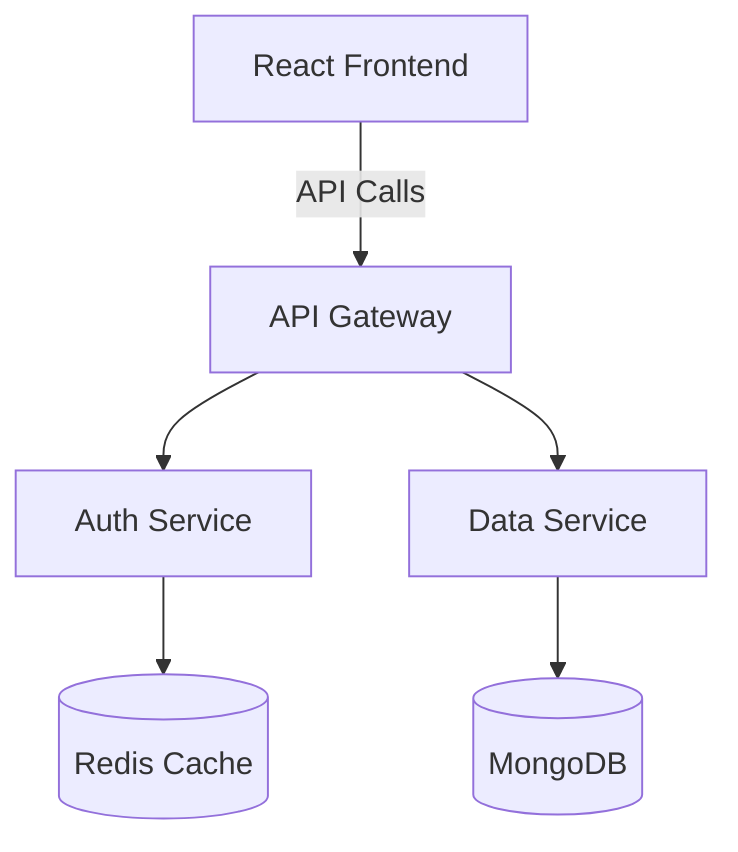

# How to Structure Your GitHub Profile for Recruiters

Your GitHub profile is often the first technical impression you make on recruiters and hiring managers. A well-structured profile can be the difference between getting an interview and being overlooked. This guide provides actionable strategies to transform your GitHub into a compelling portfolio.

---

## 🎯 Why Your GitHub Profile Matters

* **78% of recruiters** check GitHub profiles during technical hiring processes.
* Your GitHub serves as a **live portfolio** showcasing real code, not just claims on a resume.
* It demonstrates coding habits, commit frequency, collaboration skills, and code quality.
* Open source contributions signal your ability to work in real-world codebases.
* A professional GitHub profile differentiates you from candidates with similar resumes.

---

## 📌 5 Actionable Tips to Optimize Your GitHub Profile

### Tip 1: Create a Stunning Profile README

Your profile README is the first thing visitors see—make it count.

**What to Include:**

```markdown
# Hi there, I'm [Your Name] 👋

## 🚀 About Me
[2-3 sentences about who you are, what you do, and what you're passionate about]

- 🔭 Currently working on: [Current project/focus]
- 🌱 Learning: [Technologies you're currently learning]
- 👯 Looking to collaborate on: [Type of projects]
- 💬 Ask me about: [Your expertise areas]
- 📫 Reach me: [Email] | [LinkedIn] | [Portfolio]
- ⚡ Fun fact: [Something memorable about you]

## 🛠️ Tech Stack

[Visual badges for your skills]

## 📊 GitHub Stats

[GitHub stats cards]

## 🏆 Featured Projects

[Links to your best 3-4 projects with descriptions]

## 📝 Latest Blog Posts

[If you write technical blogs]
```

**Tools to Build Your Profile README:**

1. **GitHub Profile README Generator**
    * Website: [rahuldkjain.github.io/gh-profile-readme-generator](https://rahuldkjain.github.io/gh-profile-readme-generator/)
    * Auto-generates profile README with sections for skills, stats, social links.
    * Interactive form makes it beginner-friendly.
2. **GPRM (GitHub Profile README Maker)**
    * Website: [gprm.itsvg.in](https://gprm.itsvg.in/)
    * Modern templates with drag-and-drop components.
    * Instant preview and markdown copy.
3. **Profilinator**
    * Website: [profilinator.rishav.dev](https://profilinator.rishav.dev/)
    * Customize sections, add widgets, choose themes.
    * Download as markdown file.

**Profile README Inspiration:**

* **Awesome GitHub Profile READMEs**
  * Repo: [github.com/abhisheknaiidu/awesome-github-profile-readme](https://github.com/abhisheknaiidu/awesome-github-profile-readme)
  * Collection of 300+ creative profile READMEs.
* **GitHub Profile README Examples**
  * Repo: [github.com/coderjojo/creative-profile-readme](https://github.com/coderjojo/creative-profile-readme)
  * Real examples from developers at FAANG companies.

### Tip 2: Pin Your Best 6 Repositories Strategically

You can pin up to 6 repositories—choose wisely to showcase variety, impact, and technical depth.

**Strategic Pinning Framework:**

1. **Full-Stack Capstone Project:** Your most impressive, complete application (Architecture, deployment).
2. **Algorithm/Data Structures Repo:** Solutions to LeetCode, competitive programming (Problem-solving).
3. **Open Source Contribution:** Meaningful contribution to popular project (Collaboration).
4. **Framework/Library You Built:** NPM package, Python library, or custom tool (Software engineering).
5. **Different Tech Stack Project:** Project using different technologies than #1 (Versatility).
6. **Recent/Trending Tech Project:** Project using latest technology (AI/ML, Web3) (Innovation).

**Tips for Pinned Repos:**

* ✅ Each must have a detailed README.
* ✅ Include live demo links when possible.
* ✅ Use relevant topics/tags (visible under repo name).
* ✅ Ensure recent commits (shows you maintain projects).
* ✅ Add repository description (shows in search results).
* ❌ Don't pin tutorial follow-alongs or coursework assignments.
* ❌ Avoid repos with just a README and no code.

### Tip 3: Craft a Professional Bio & Profile Details

Your bio is limited to 160 characters—make every word count.

**Bio Formula:**
`[Role] @ [Company/University] | [Primary Tech Stack] | [Specialization/Interest] | [Call to Action]`

**Good Examples:**

* ✅ "Full-Stack Developer | React, Node.js, AWS | Building scalable web apps | Open to opportunities"
* ✅ "CS Student @ MIT | Python, ML enthusiast | Contributing to open source | Check out my projects ⬇️"
* ✅ "Backend Engineer | Go, Docker, K8s | Passionate about distributed systems | Let's collaborate!"

**Bad Examples:**

* ❌ "Passionate developer and tech enthusiast" (Too vague)
* ❌ "Learning to code" (Doesn't inspire confidence)
* ❌ "JavaScript HTML CSS Python Java C++ React Angular Vue" (Keyword stuffing)

**Profile Enhancement Tools:**

1. **GitHub Profile Views Counter**: [komarev.com/ghpvc](https://komarev.com/ghpvc/?username=YOUR_USERNAME)
2. **GitHub Readme Streak Stats**: [github-readme-streak-stats.herokuapp.com](https://github-readme-streak-stats.herokuapp.com/)

### Tip 4: Showcase Your Activity with README Stats & Widgets

Visual statistics make your profile engaging and provide quick insights into your work.

**Essential GitHub Stats Cards:**

1. **GitHub Stats Card**
    * Website: [github-readme-stats](https://github.com/anuraghazra/github-readme-stats)
    * Shows: Total stars, commits, PRs, issues, contributions.
    * Code: ``
2. **Top Languages Card**
    * Visualizes language distribution.
    * Code: ``
3. **Streak Stats**
    * Shows contribution streak.
    * Website: [github-readme-streak-stats](https://github-readme-streak-stats.herokuapp.com/)
4. **Activity Graph**
    * Code: `[](https://github.com/ashutosh00710/github-readme-activity-graph)`

**Tech Stack Badges:**

* **Shields.io**: [https://shields.io/](https://shields.io/)
* **Skill Icons**: [https://skillicons.dev/](https://skillicons.dev/)
* **Simple Icons**: [https://simpleicons.org/](https://simpleicons.org/)

**⚠️ Important Notes:**

* Don't overdo it: 3-5 widgets maximum.
* Choose a consistent theme.
* Update regularly.
* Test on mobile.

### Tip 5: Maintain Consistent & Quality Contributions

Your contribution graph (green squares) tells a story about your coding habits.

**Strategies for a Healthy Contribution Graph:**

1. **Commit Regularly:** Daily small commits > massive weekend coding sessions.
2. **Quality Over Quantity:** Meaningful commits with good messages (e.g., "feat: add user authentication" vs "update").
3. **Diversify Contribution Types:** Code commits, PRs, Issues, Code reviews.
4. **Make Private Contributions Visible:** Enable "Private contributions" in settings.
5. **Contribute to Open Source:**
    * Good First Issue: [goodfirstissue.dev](https://goodfirstissue.dev)
    * First Timers Only: [firsttimersonly.com](https://firsttimersonly.com)
    * CodeTriage: [codetriage.com](https://codetriage.com)

---

## 📄 Professional Project README Template

A great project README can make your repository stand out. Here's a comprehensive template that looks impressive on resumes and to recruiters.

```markdown
<div align="center">
  
  
  # Project Name
  
  ### Tagline: Brief, catchy description of what your project does
  
  [](LICENSE)
  []()
  []()
  
  [Live Demo](https://your-demo-link.com) · [Report Bug](https://github.com/username/repo/issues) · [Request Feature](https://github.com/username/repo/issues)
</div>

---

## 📋 Table of Contents

- [About The Project](#about-the-project)
  - [Built With](#built-with)
  - [Key Features](#key-features)
- [Getting Started](#getting-started)
  - [Prerequisites](#prerequisites)
  - [Installation](#installation)
- [Usage](#usage)
- [Screenshots](#screenshots)
- [Architecture](#architecture)
- [API Documentation](#api-documentation)
- [Roadmap](#roadmap)
- [Contributing](#contributing)
- [License](#license)
- [Contact](#contact)
- [Acknowledgments](#acknowledgments)

---

## 🎯 About The Project

[](https://your-demo-link.com)

**Problem Statement:**
[Describe the problem your project solves in 2-3 sentences. Why does this project exist?]

**Solution:**
[Explain your approach to solving the problem. What makes your solution unique?]

**Impact:**
[Quantify the impact if possible. e.g., "Reduces processing time by 60%" or "Serves 1000+ users daily"]

### Built With

* [](https://reactjs.org/)
* [](https://nodejs.org/)
* [](https://www.mongodb.com/)

### ✨ Key Features

- 🔐 **User Authentication**: JWT-based authentication with role-based access control
- 📊 **Real-time Dashboard**: Live data visualization using WebSockets
- 🔍 **Advanced Search**: Full-text search with filters and pagination
- 📱 **Responsive Design**: Mobile-first approach, works on all devices

---

## 🚀 Getting Started

### Prerequisites

```bash
# Node.js 16+ required
node --version
```

### Installation

1. Clone the repository

   ```bash
   git clone https://github.com/username/project-name.git
   ```

2. Navigate to project directory

   ```bash
   cd project-name
   ```

3. Install dependencies

   ```bash
   npm install
   ```

4. Set up environment variables

   ```bash
   cp .env.example .env
   ```

   Edit `.env` with your configuration.

5. Run database migrations

   ```bash
   npm run migrate
   ```

6. Start the development server

   ```bash
   npm run dev
   ```

---

## 💡 Usage

```javascript
// Example: Creating a new user
const user = await createUser({
  name: 'John Doe',
  email: 'john@example.com',
  password: 'securePassword123'
});
```

---

## 🏗️ Architecture



---

## 🤝 Contributing

1. Fork the Project
2. Create your Feature Branch (`git checkout -b feature/AmazingFeature`)
3. Commit your Changes (`git commit -m 'Add some AmazingFeature'`)
4. Push to the Branch (`git push origin feature/AmazingFeature`)
5. Open a Pull Request

---

## 👤 Contact

Your Name - [@twitter_handle](https://twitter.com/yourhandle) - <email@example.com>
Project Link: [https://github.com/username/project-name](https://github.com/username/project-name)
Portfolio: [https://yourportfolio.com](https://yourportfolio.com)

```

---

## 🎯 Action Plan: 7-Day GitHub Makeover

Transform your GitHub profile in one week:

*   **Day 1:** Profile Picture, Bio, Location, Links, Pin 3-4 repos.
*   **Day 2:** Create Profile README with stats and tech stack.
*   **Day 3:** Audit repos, archive old ones, add topics/descriptions.
*   **Day 4-5:** Upgrade pinned repo READMEs (use template), add screenshots/demos.
*   **Day 6:** 5-7 commits, star interesting repos, find one "good first issue".
*   **Day 7:** Final polish, mobile check, share on LinkedIn.

**Remember:** Quality > Quantity. Consistency matters. Documentation is code.
